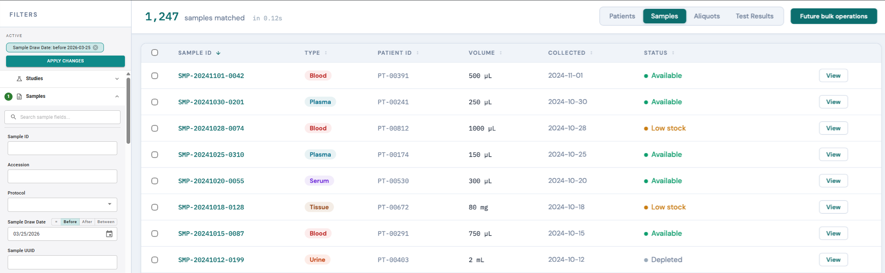

# React + TypeScript Coding Exercise: Search Layout
This is a multi-part exercise

## Parts

### Part 1: Senior Frontend knowledge assessment
- (1) Work estimation & risk assessment
- (2) Async javascript, react hooks, & backend API integration

### Part 2a: (Continued) Senior Frontend knowledge assessment
- (3a) Layout boilerplate coding
- (4a) API design

### Part 2b: LLM rigor Evaluation
- (3b) Common LLM failure modes & mitigation strategies
- (4b) Anticipating LLM behavior

## Getting started
Clone this repository:
```bash
git clone git@github.com:csmerrell-biz/search-prototype.git
```

Install dependencies:
```bash
npm ci
```

Run the dev build:
```bash
npm run dev
```

Mockup of an "advanced search" feature we've been asked to build:



## Exercise 1: Creating Clarity from Ambiguity - Complexity & Risk Estimation
You're estimating the full scope of work required to build out the new "Search" feature. Key context: 
- The search feature has 3 critical backend dependencies:
  - `(GET) /entities`
    - An entity is a user-defined collection of fields grouped under a single name.
    - ALREADY EXISTS: You have to work with an existing response type.
  - `(GET) /fields`
    - A field is a metadata definition of a form field.
    - ALREADY EXISTS
  - `(GET/POST) /search`
    - DOES NOT EXIST. NEW REQUIREMENT.
---

### API Data Models
#### `(GET) /fields`
```ts
type EntityField = {
  id: number;
  name: string;
  type: 'text' | 'number' | 'date' | 'select';
  isUnique: boolean;
  options?: Record<number, string> //Only present on select fields
}

type EntityFieldsResponse = EntityField[];
```

#### `(GET) /entities`
```ts
type FormEntity = {
  name: string;
  fields: number[]; //ids that map to field.id from the entity field response
}

type EntitiesResponse = Entity[];
```

#### `(GET/POST) /search`
TO BE DEFINED in later exercise.

### Exercise 1 Requirements
1. Explain how the pre-existing GET endpoints can be used to produce the left panel of search filters. Pseudo code is encouraged.
2. Ask questions to identify 3-5 requested features that are not achievable with the pre-existing backend endpoints.
3. Identify 2-3 high risk features from the requested mockup.
  - High Risk can be any of:
    - Includes at least one significant unknown that could unexpectedly delay delivery.
    - Likely to result in a bug tail.

## Exercise 2: Async javascript basics, react hooks & API integration 
1. Write simulated fetch methods that return promises resolving to the following mock response objects:
  - `(GET) /fields`:
```ts 
const fieldsResponse: EntityFieldsResponse = [
  {
    id: 1,
    name: "Sample Type",
    type: 'select',
    isUnique: false,
    options: {
      1: "Blood",
      2: "Tissue"
    };
  },
  {
    id: 2,
    name: "Patient Full Name",
    type: 'text',
    isUnique: false,
  },
]
```
  - `(GET) /entities`
```ts
const entitiesResponse: EntitiesResponse = [
  {
    name: 'Samples',
    fields: [1],
  },
  {
    name: 'Patients',
    fields: [2],
  },
]
```
2. Invoke the mock fetch using a react hook, join the two responses into a computed `EntitiesWithFields` array. Display the computed array in the component in a simple, unstyled format.

# Branching Exercises
The back half of the exercises can go one of two routes:

a. HTML/CSS & API Design
  - Continued traditional frontend technical evaluation
b. LLM-in-the-loop workflows
  - If you regularly develop with LLMs in your daily workflow, we want to evaluate your level of knowledge and engineering rigor with these tools.

Note: Whether your daily LLM usage is high or low won't reflect poorly on you. If you use them often, we have a strong preference that we evaluate (b) LLM knowledge over (a) traditional HTML/CSS & API Design.

# Branch (a) - Continued Frontend technical eval

## Exercise 3a: HTML/CSS Layout Boilerplate
Quickly prototype the general layout of the search page. Block out as many elements as possible in the following order:

1. Two panel layout
  - Use dummy copy (text) to label different parts of the layout.
  - Styling is not important, aside from the scroll behavior detailed in the next bullet.
  - Show the following scroll behavior:
    - Left panel: 
      - NON-SCROLLABLE: 
        - "Filters" header
        - "Active filters" section
      - SCROLLABLE:
        - Entity filters
          - Stub this with a <ul> rendering an array of dummy copy to force scroll behavior.
    - Right panel:
      - NON-SCROLLABLE:
        - Top header (matched entity count, entity result tabs)
      - SCROLLABLE:
        - "Search Results" container.
          - Stub this with a <ul> rendering an array of dummy copy to force scroll behavior.
2. Prototype two collapsible filter sections that render using the computed `EntitiesWithFields` array from Exercise 2.
  - Branch on `field.type` to render unstyled text/select inputs.


## Exercise 4a: API Design - `(GET/POST) /search`
1. Propose a rough draft of typescript models for the search API:
  - The search request signature. Either GET/POST is fine:
    - (GET) query params structure
    - (POST) request body
  - A reasonable search response model.
  - NOTE: Pseudo code is expected, but try to highlight specific knowledge of typescript.
2. Write up a sample fetch call & response handler to execute a query against this mock API.

# Branch (b) - LLM-in-the-loop development

## Exercise 3b: LLM failure modes and mitigation strategies
LLMs are prone to various failure modes. Describe 3 common LLM failure modes and describe, in detail, how to mitigate for them. We recommend that you avoid generic answers like "write detailed prompts" and "review their output." 

Note that we're NOT looking for adversarial (but important!) things like prompt injection. We're interested in internal developer-use failure modes, such as:
- Thrash-and-collapse (or thrash-and-eject)
  - LLM gets something wrong, then spirals and get progressively worse (or gives up).
- Verification Cheese 
  -`expect(true).toBe(true)` or `echo "Tests passed successfully!"`

PS: It's ok to expound on the 2 failure modes above if you have strong answers for mitigation strategies.

PPS: Some common developer pitfalls & LLM-failure modes don't have great mitigation strategies. A high quality answer may detail why some common flavor of LLM-usage should be scrutinized. e.g. - "LLMs should not be used to ----" (explain why)

## Exercise 4b: Anticipating LLM behavior
Open the `/bitdev` skill definition in [.claude/skills/dev/SKILL.md](.claude/skills/dev/SKILL.md). 
  
Note: If you're unfamiliar with LLM "skills", that's fine. You should still be able to answer this question. It is ok to ask for a brief definition of an LLM "skill" (they're not that magical).

Read through the prompt and discuss/explain any/all of the following in any order:
1. What immediate response do you expect from an LLM when invoking this skill? 
  - What long term behaviors would you expect from an LLM when invoking this skill? 
2. What common failure modes does this skill mitigate for? How?
3. The prompt calls out a `test:file` npm script multiple times. This script executes a single unit test and produces a coverage report for ONLY that file. Why would this be useful? (There are at least 2 good answers, and it's not about speed).